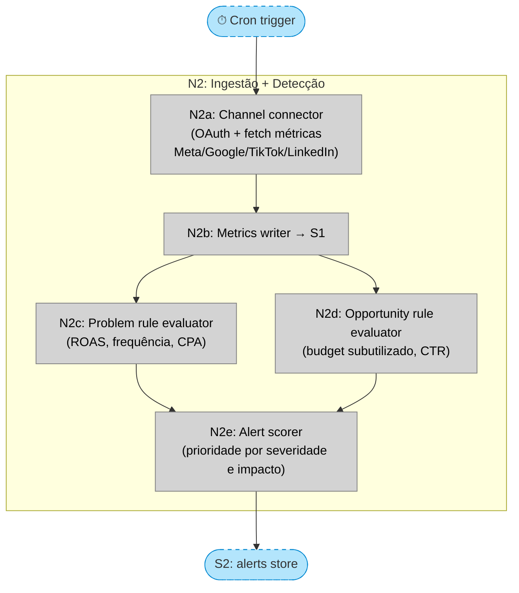

# Plataforma de Gestão de Campanhas Multi-Canal — Shaping

---

## Problema

Gestores de tráfego e equipes de mídia paga que operam múltiplas contas e canais (Meta, Google, TikTok, LinkedIn) não conseguem identificar e agir sobre oportunidades e problemas de performance em tempo real. O trabalho de monitoramento, análise e otimização é manual, lento e fragmentado entre plataformas.

**O que está quebrado hoje:**
- Otimizações são feitas manualmente, campanha a campanha, dentro de cada plataforma
- Não existe visão consolidada de performance cross-canal em um único lugar
- Oportunidades (orçamento subutilizado, criativos em fadiga, palavras-chave negativas) são identificadas tardiamente ou não identificadas
- Não há registro auditável de quem fez o quê e qual foi o impacto

**Hipótese principal:** Gestores de tráfego aplicarão otimizações com mais frequência e velocidade quando a sugestão vier com diagnóstico claro + impacto projetado + botão de ação — reduzindo a fricção da decisão.

**Indicador de sucesso:** Tempo médio entre identificação de um problema de performance e aplicação de uma correção (time-to-action).

---

## Requirements (R)

| ID | Requirement | Status |
|----|-------------|--------|
| R0 | Gestores identificam e agem sobre problemas e oportunidades de performance multi-canal sem sair da plataforma | Core goal |
| R1 | Integração com Meta Ads, Google Ads, TikTok Ads e LinkedIn Ads | Must-have |
| R2 | Detecção automática de problemas e oportunidades (fadiga criativa, orçamento subutilizado, anomalias de ROAS/CPA) | Must-have |
| R3 | Sugestões de otimização com diagnóstico e impacto projetado | Must-have |
| R4 | Aplicação (ou descarte) de uma otimização com um clique | Must-have |
| R5 | Log de execução com rastreabilidade completa de ações (humano + IA) | Must-have |
| R6 | Dashboard consolidado com alertas proativos em tempo real (Sentinela) | Must-have |
| R7 | Agrupamento estratégico de campanhas (Clusters/Portfólios) | Undecided |
| R8 | Suporte multi-cliente para agências | Undecided |

> **Nota R6:** "Tempo real" depende da frequência do sync. As APIs das plataformas têm latência de 15–30min — o que a plataforma oferece é sync frequente, não streaming verdadeiro.

---

## Shape A: Feed de alertas por canal com ação direta

Shape selecionada. Essência: canal-nativo. Cada alerta pertence a um canal específico. Detecção rule-based. Usuário age via feed priorizado.

**Por que A e não B/C:**
- Shape B (portfólios cross-canal) tem dois ⚠️ no caminho crítico: modelo de dados unificado cross-canal e sugestões de realocação entre canais — risco antes de validar o produto
- Shape C (fila de aprovação com IA autônoma) muda o modelo mental antes de o usuário confiar na IA
- Clusters (R7) existem em A como camada de organização UI, não como engine de decisão

| Part | Mechanism | Flag |
|------|-----------|:----:|
| **A1** | **Ingestão de dados** | |
| A1.1 | OAuth connectors por canal (Meta, Google, TikTok, LinkedIn) | |
| A1.2 | Sync periódico de métricas (campanhas, ad sets, anúncios) | |
| A1.3 | Store de métricas brutas por canal | |
| **A2** | **Motor de detecção (rule-based)** | |
| A2.1 | Regras de problema: ROAS abaixo de threshold, frequência acima de X, CPA acima de Y | |
| A2.2 | Regras de oportunidade: budget subutilizado com ROAS alto, criativos com CTR crescente | |
| A2.3 | Scorer de prioridade (classifica alertas por severidade e impacto estimado) | |
| **A3** | **Feed de alertas (Sentinela)** | |
| A3.1 | Alert card: canal, campanha, diagnóstico em linguagem natural, impacto projetado | |
| A3.2 | Filtro por canal, cluster e status (novo / aplicado / ignorado) | |
| A3.3 | Resumo matinal: top N alertas priorizados ao abrir a plataforma | |
| **A4** | **Executor de ações** | |
| A4.1 | Action mapper: traduz ação genérica (pause, bid+10%, budget+20%) para chamada de API nativa de cada canal | |
| A4.2 | Modal de confirmação com preview do impacto antes de aplicar | |
| A4.3 | Write-back via API do canal após confirmação | |
| **A5** | **Log de execução** | |
| A5.1 | Registro por ação: quem, o quê, quando, canal, métricas antes | |
| A5.2 | Impact tracker: puxa métricas pós-ação para comparar projetado vs. realizado | |
| **A6** | **Clusters (agrupamento UI)** | |
| A6.1 | CRUD de clusters: usuário cria, nomeia e atribui campanhas (cross-canal) | |
| A6.2 | Feed de alertas filtrado por cluster | |
| A6.3 | Health summary por cluster: métricas agregadas das campanhas do grupo | |
| **A7** | **Multi-cliente** | |
| A7.1 | Workspace isolation: cada cliente tem contexto de dados isolado | |
| A7.2 | Central de Contas: visão de agência com switch entre clientes | |

---

## Fit Check: R × A

| Req | Requirement | Status | A |
|-----|-------------|--------|---|
| R0 | Gestores identificam e agem sobre problemas e oportunidades de performance multi-canal sem sair da plataforma | Core goal | ✅ |
| R1 | Integração com Meta Ads, Google Ads, TikTok Ads e LinkedIn Ads | Must-have | ✅ |
| R2 | Detecção automática de problemas e oportunidades (fadiga criativa, orçamento subutilizado, anomalias de ROAS/CPA) | Must-have | ✅ |
| R3 | Sugestões de otimização com diagnóstico e impacto projetado | Must-have | ✅ |
| R4 | Aplicação (ou descarte) de uma otimização com um clique | Must-have | ✅ |
| R5 | Log de execução com rastreabilidade completa de ações (humano + IA) | Must-have | ✅ |
| R6 | Dashboard consolidado com alertas proativos em tempo real (Sentinela) | Must-have | ✅ |
| R7 | Agrupamento estratégico de campanhas (Clusters/Portfólios) | Undecided | ✅ |
| R8 | Suporte multi-cliente para agências | Undecided | ✅ |

---

## Detail A: Breadboard

### Places

| # | Place | Description |
|---|-------|-------------|
| P0 | Central de Contas | Lista de clientes; entry point para agências |
| P1 | Dashboard / Sentinela | Feed de alertas + resumo matinal |
| P1.1 | Resumo Matinal | Subplace: sumário de alertas prioritários |
| P1.2 | Feed de Alertas | Subplace: lista completa com filtros |
| P2 | Modal de Confirmação | Bloqueante — confirmação antes de aplicar ação |
| P3 | Log de Execução | Histórico auditável de todas as ações |
| P4 | Gerenciamento de Clusters | CRUD de agrupamentos de campanhas |
| P5 | Backend | Ingestão, detecção, execução, stores |

### UI Affordances

| # | Place | Componente | Affordance | Control | Wires Out | Returns To |
|---|-------|------------|------------|---------|-----------|------------|
| U1 | P0 | client-list | lista de clientes | render | — | — |
| U2 | P0 | client-card | card de cliente (nome, métricas rápidas) | click | → N1, → P1 | — |
| U10 | P1.1 | morning-summary | contador de alertas ativos | render | — | — |
| U11 | P1.1 | morning-summary | top alertas priorizados (N de maior score) | render | — | — |
| U12 | P1.1 | morning-summary | link "Ver todos" | click | → P1.2 | — |
| U20 | P1.2 | alert-feed | filtro por canal (Meta/Google/TikTok/LinkedIn) | click | → N10 | — |
| U21 | P1.2 | alert-feed | filtro por cluster | select | → N10 | — |
| U22 | P1.2 | alert-feed | filtro por status (novo/aplicado/ignorado) | click | → N10 | — |
| U23 | P1.2 | alert-card | card: canal, campanha, diagnóstico, impacto projetado, prioridade | render | — | — |
| U24 | P1.2 | alert-card | botão "Aplicar" | click | → P2 | — |
| U25 | P1.2 | alert-card | botão "Ignorar" | click | → N12 | — |
| U26 | P1.2 | alert-card | badge de status | render | — | — |
| U30 | P2 | confirm-modal | resumo da ação proposta | render | — | — |
| U31 | P2 | confirm-modal | impacto projetado detalhado | render | — | — |
| U32 | P2 | confirm-modal | botão "Confirmar" | click | → N13 | — |
| U33 | P2 | confirm-modal | botão "Cancelar" | click | → P1 | — |
| U40 | P3 | execution-log | lista de ações executadas | render | — | — |
| U41 | P3 | log-row | linha do log (quem, quando, canal, campanha, ação) | render | — | — |
| U42 | P3 | log-row | delta de métricas antes/depois | render | — | — |
| U43 | P3 | log-filter | filtros (canal, data, usuário) | click | → N17 | — |
| U50 | P4 | cluster-list | lista de clusters | render | — | — |
| U51 | P4 | cluster-manager | botão "Novo Cluster" | click | → U52 (local) | — |
| U52 | P4 | cluster-form | form: nome + seleção de campanhas | render | — | — |
| U53 | P4 | cluster-form | botão "Salvar" | click | → N19 | — |
| U54 | P4 | cluster-list | botão "Excluir" | click | → N20 | — |

### Code Affordances

| # | Place | Componente | Affordance | Control | Wires Out | Returns To |
|---|-------|------------|------------|---------|-----------|------------|
| N1 | P0 | client-switcher | `switchClient(clientId)` | call | → S5 | — |
| N2 | P5 | — | CHUNK: Ingestão + Detecção | scheduled | → S1, → S2 | — |
| N10 | P1.2 | alert-feed | `getAlerts(filters)` | call | → S2 | → U23, U26 |
| N11 | P1.1 | morning-summary | `getMorningSummary()` | call | → S2 | → U10, U11 |
| N12 | P1.2 | alert-feed | `ignoreAlert(alertId)` | call | → S2 | → U26 |
| N13 | P2 | confirm-modal | `applyAction(alertId)` | call | → N14 | — |
| N14 | P5 | action-mapper | traduz ação genérica → chamada API nativa do canal | call | → N15 | — |
| N15 | P5 | channel-executor | write API do canal (pause, bid, budget) | call | → N16 | — |
| N16 | P5 | log-writer | grava registro no log (quem, o quê, quando, antes) | call | → S2, → S3 | → P1 |
| N17 | P3 | log-api | `getLog(filters)` | call | → S3 | → U41, U42 |
| N18 | P5 | impact-tracker | compara métricas T+24h/48h pós-ação e atualiza S3 | scheduled | → S3 | — |
| N19 | P4 | cluster-api | `saveCluster(data)` | call | → S4 | → U50 |
| N20 | P4 | cluster-api | `deleteCluster(id)` | call | → S4 | → U50 |
| N21 | P0 | client-api | `getClients()` | call | → S5 | → U1 |

### Data Stores

| # | Place | Store | Descrição |
|---|-------|-------|-----------|
| S1 | P5 | metrics store | Métricas brutas por canal/campanha/ad set (time series) |
| S2 | P5 | alerts store | Alertas: canal, campanha, diagnóstico, impacto projetado, prioridade, status |
| S3 | P5 | execution log | Ações: quem, quando, canal, campanha, métricas antes/depois |
| S4 | P5 | clusters store | Clusters: nome, campanhas associadas |
| S5 | P0 | active client | Workspace/cliente atualmente selecionado |

### Chunk: Ingestão + Detecção (N2)

### Diagrama Principal

```mermaid
flowchart TB

subgraph P0["P0: Central de Contas"]
    U1["U1: lista de clientes"]
    U2["U2: card de cliente"]
    N1["N1: switchClient()"]
    N21["N21: getClients()"]
    S5["S5: active client"]
end

subgraph P1["P1: Dashboard / Sentinela"]
    subgraph P1_1["P1.1: Resumo Matinal"]
        U10["U10: contador alertas ativos"]
        U11["U11: top alertas priorizados"]
        U12["U12: 'Ver todos'"]
        N11["N11: getMorningSummary()"]
    end

    subgraph P1_2["P1.2: Feed de Alertas"]
        U20["U20: filtro canal"]
        U21["U21: filtro cluster"]
        U22["U22: filtro status"]
        U23["U23: alert card\n(diagnóstico + impacto)"]
        U24["U24: botão Aplicar"]
        U25["U25: botão Ignorar"]
        U26["U26: badge status"]
        N10["N10: getAlerts(filters)"]
        N12["N12: ignoreAlert()"]
    end
end

subgraph P2["P2: Modal de Confirmação"]
    U30["U30: resumo da ação"]
    U31["U31: impacto projetado"]
    U32["U32: botão Confirmar"]
    U33["U33: botão Cancelar"]
    N13["N13: applyAction()"]
end

subgraph P3["P3: Log de Execução"]
    U40["U40: lista de ações"]
    U41["U41: linha do log"]
    U42["U42: delta antes/depois"]
    U43["U43: filtros"]
    N17["N17: getLog(filters)"]
end

subgraph P4["P4: Clusters"]
    U50["U50: lista de clusters"]
    U51["U51: Novo Cluster"]
    U52["U52: form cluster"]
    U53["U53: Salvar"]
    U54["U54: Excluir"]
    N19["N19: saveCluster()"]
    N20["N20: deleteCluster()"]
end

subgraph P5["P5: Backend"]
    N2[["CHUNK:\nIngestão + Detecção"]]
    N14["N14: action-mapper"]
    N15["N15: channel-executor"]
    N16["N16: log-writer"]
    N18["N18: impact-tracker\n(async T+24h)"]
    S1["S1: metrics store"]
    S2["S2: alerts store"]
    S3["S3: execution log"]
    S4["S4: clusters store"]
end

N21 -.-> U1
U2 --> N1
N1 --> S5
N1 --> P1

N2 --> S1
N2 --> S2

N11 --> S2
S2 -.-> U10
S2 -.-> U11
U12 --> P1_2

U20 --> N10
U21 --> N10
U22 --> N10
N10 --> S2
S2 -.-> U23
S2 -.-> U26

U24 --> P2
U30 -.->|alert context| S2
U31 -.->|alert context| S2
U32 --> N13
N13 --> N14
N14 --> N15
N15 --> N16
N16 --> S2
N16 --> S3
N16 --> P1
U33 --> P1

U25 --> N12
N12 --> S2
S2 -.-> U26

U43 --> N17
N17 --> S3
S3 -.-> U41
S3 -.-> U42
N18 --> S3

U51 --> U52
U53 --> N19
U54 --> N20
N19 --> S4
N20 --> S4
S4 -.-> U50

classDef ui fill:#ffb6c1,stroke:#d87093,color:#000
classDef nonui fill:#d3d3d3,stroke:#808080,color:#000
classDef store fill:#e6e6fa,stroke:#9370db,color:#000
classDef chunk fill:#b3e5fc,stroke:#0288d1,color:#000,stroke-width:2px

class U1,U2,U10,U11,U12,U20,U21,U22,U23,U24,U25,U26,U30,U31,U32,U33,U40,U41,U42,U43,U50,U51,U52,U53,U54 ui
class N1,N10,N11,N12,N13,N14,N15,N16,N17,N18,N19,N20,N21 nonui
class S1,S2,S3,S4,S5 store
class N2 chunk
```

---

## Slices

### Resumo

| # | Slice | Mecanismo | Demo |
|---|-------|-----------|------|
| V1 | Feed com dados reais | A1, A2, A3 | "Dashboard abre e mostra alertas reais de campanha" |
| V2 | Aplicar ação | A4 | "Clicar Aplicar, confirmar no modal, alerta vira 'aplicado'" |
| V3 | Log de execução | A5 | "Abrir log e ver quem fez o quê, com métricas antes/depois" |
| V4 | Filtros + Ignorar | A3 | "Filtrar por Meta, ignorar um alerta, badge atualiza" |
| V5 | Clusters | A6 | "Criar cluster 'Black Friday', filtrar feed por ele" |
| V6 | Multi-cliente | A7 | "Agência vê lista de clientes, clica num, dashboard muda" |

### V1 — Feed com dados reais

> **Demo:** "Abrir o dashboard e ver alertas reais de campanha priorizados."

| # | Componente | Affordance | Control | Wires Out | Returns To |
|---|------------|------------|---------|-----------|------------|
| N2 | Backend | CHUNK: Ingestão + Detecção | scheduled | → S1, → S2 | — |
| S1 | Backend | metrics store | — | — | → N2 |
| S2 | Backend | alerts store | — | — | → N10, N11 |
| N11 | morning-summary | `getMorningSummary()` | call | → S2 | → U10, U11 |
| N10 | alert-feed | `getAlerts()` | call | → S2 | → U23, U26 |
| U10 | morning-summary | contador de alertas ativos | render | — | — |
| U11 | morning-summary | top alertas priorizados | render | — | — |
| U12 | morning-summary | link "Ver todos" | click | → P1.2 | — |
| U23 | alert-card | card: canal, campanha, diagnóstico, impacto, prioridade | render | — | — |
| U26 | alert-card | badge de status ("novo") | render | — | — |

### V2 — Aplicar ação

> **Demo:** "Clicar 'Aplicar' em um alerta, confirmar no modal, alerta muda para 'aplicado' no feed."

| # | Componente | Affordance | Control | Wires Out | Returns To |
|---|------------|------------|---------|-----------|------------|
| U24 | alert-card | botão "Aplicar" | click | → P2 | — |
| U30 | confirm-modal | resumo da ação proposta | render | — | — |
| U31 | confirm-modal | impacto projetado detalhado | render | — | — |
| U32 | confirm-modal | botão "Confirmar" | click | → N13 | — |
| U33 | confirm-modal | botão "Cancelar" | click | → P1 | — |
| N13 | confirm-modal | `applyAction(alertId)` | call | → N14 | — |
| N14 | action-mapper | traduz ação → API nativa do canal | call | → N15 | — |
| N15 | channel-executor | write API do canal | call | → N16 | — |
| N16 | log-writer | grava registro (quem, o quê, antes) | call | → S2, → S3 | → P1 |
| S3 | Backend | execution log | — | — | → N17 |

### V3 — Log de execução

> **Demo:** "Abrir o Log de Execução e ver todas as ações com quem executou, quando, e delta de métricas."

| # | Componente | Affordance | Control | Wires Out | Returns To |
|---|------------|------------|---------|-----------|------------|
| U40 | execution-log | lista de ações executadas | render | — | — |
| U41 | log-row | linha do log (quem, quando, canal, campanha, ação) | render | — | — |
| U42 | log-row | delta de métricas antes/depois | render | — | — |
| U43 | log-filter | filtros (canal, data, usuário) | click | → N17 | — |
| N17 | log-api | `getLog(filters)` | call | → S3 | → U41, U42 |
| N18 | impact-tracker | compara métricas T+24h/48h, atualiza S3 | scheduled | → S3 | — |

### V4 — Filtros + Ignorar

> **Demo:** "Filtrar feed por Meta, ver só alertas do Meta. Ignorar um alerta, badge muda para 'ignorado'."

| # | Componente | Affordance | Control | Wires Out | Returns To |
|---|------------|------------|---------|-----------|------------|
| U20 | alert-feed | filtro por canal | click | → N10 | — |
| U21 | alert-feed | filtro por cluster | select | → N10 | — |
| U22 | alert-feed | filtro por status | click | → N10 | — |
| U25 | alert-card | botão "Ignorar" | click | → N12 | — |
| N12 | alert-feed | `ignoreAlert(alertId)` | call | → S2 | → U26 |

### V5 — Clusters

> **Demo:** "Criar cluster 'Black Friday', atribuir campanhas, filtrar o feed por esse cluster."

| # | Componente | Affordance | Control | Wires Out | Returns To |
|---|------------|------------|---------|-----------|------------|
| U50 | cluster-list | lista de clusters | render | — | — |
| U51 | cluster-manager | botão "Novo Cluster" | click | → U52 | — |
| U52 | cluster-form | form: nome + seleção de campanhas | render | — | — |
| U53 | cluster-form | botão "Salvar" | click | → N19 | — |
| U54 | cluster-list | botão "Excluir" | click | → N20 | — |
| N19 | cluster-api | `saveCluster(data)` | call | → S4 | → U50 |
| N20 | cluster-api | `deleteCluster(id)` | call | → S4 | → U50 |
| S4 | Backend | clusters store | — | — | → N19, N20 |

### V6 — Multi-cliente

> **Demo:** "Agência abre Central de Contas, vê lista de clientes, clica em um e o dashboard carrega o workspace desse cliente."

| # | Componente | Affordance | Control | Wires Out | Returns To |
|---|------------|------------|---------|-----------|------------|
| U1 | client-list | lista de clientes | render | — | — |
| U2 | client-card | card de cliente (nome, métricas rápidas) | click | → N1, → P1 | — |
| N21 | client-api | `getClients()` | call | → S5 | → U1 |
| N1 | client-switcher | `switchClient(clientId)` | call | → S5 | — |
| S5 | P0 | active client | — | — | → N10, N11 |
